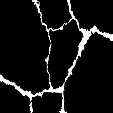
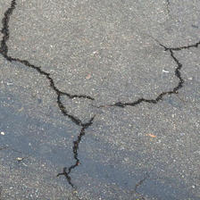

# DINOv2 Crack Detection with Dual-Teacher Distillation & Lipschitz Constraints


## 📖 Overview

This repository contains the official implementation of a DINOv2-based crack detection method that integrates heterogeneous dual-teacher knowledge distillation and Lipschitz constraints, designed to tackle challenges such as fragile elongated structures, difficult multi-scale fusion, and environmental noise interference in crack detection.


## ✨ Key Features

🧠 Heterogeneous Dual-Teacher Knowledge Distillation Framework: Combines the high-level semantic comprehension of DINOv2-large with the detailed feature preservation capabilities of DINOv2-base.  

🔗 Channel Attention Feature Fusion Module (CAFM): Adaptively fuses multi-source heterogeneous features from different teachers.  

🛡️ Lipschitz-Constrained Decoder: Enhances model robustness against noise and adversarial perturbations through Spectral Normalization (SN) and Gradient Penalty (GP).  

📈 High Performance: Achieves 61.91% Crack_IoU and 75.49% F1-score on the DeepCrack dataset, with improved stability under adversarial attacks.  


## 📋 Table of Contents

- [Installation](#installation)
- [Dataset Preparation](#dataset-preparation)
- [Visual Detection Results](#visual-detection-results)
- [License](#license)
- [Acknowledgments](#Acknowledgments)


## 🛠 Installation

### Prerequisites
- Python 3.8+
- PyTorch 1.20+
- CUDA 11.8 (recommended for GPU acceleration)

### Step-by-Step Installation
```bash
# 1. Clone this repository
git clone https://github.com/fengzhou10/DINOv2-Crack-Detection.git
cd DINOv2-Crack-Detection

# 2. Create and activate a virtual environment (optional but recommended)
conda create -n dinocrack python=3.8
conda activate dinocrack

# 3. Install PyTorch (adjust based on your CUDA version)
# For CUDA 11.8:
pip install torch==1.20.0 torchvision==0.15.0 --index-url https://download.pytorch.org/whl/cu118

# 4. Install other dependencies
pip install -r requirements.txt
```

## 📊 Dataset Preparation

### Download DeepCrack Dataset
Download the DeepCrack dataset from the official source: https://github.com/yhlleo/DeepCrack/tree/master/dataset

Organize the dataset as follows:
|Folder|Description|
|:----|:-----|
|`train_img`|RGB images for training|
|`train_lab`|binary annotation for training images|
|`test_img`|RGB images for testing|
|`test_lab`|binary annotation for testing images|


## 📊 Visual Dtection Result

|Image|Ground truth|Ours Model|
|:---|:---|:---|
||||
||||


## 📄 License

This project is licensed under the MIT License - see the LICENSE file for details.


## 🙏 Acknowledgments

Thanks to the DINOv2 team for their excellent pre-trained models  

Thanks to the DeepCrack dataset providers  

Thanks to all contributors and reviewers of this project  
